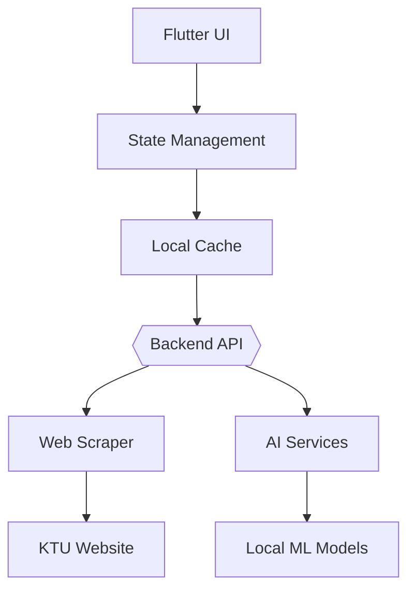

# 📚 KTU Companion - Student Portal


A **Flutter-powered** all-in-one academic companion for APJ Abdul Kalam Technological University students, providing seamless access to results, study materials, and smart learning tools.

---

## ✨ Key Features

### 📊 Academic Tools
| Feature | Description | 
|---------|-------------|
| **Real-time Result Checker** | Instant GPA/SGPA calculation with historical trend analysis |
| **Smart Notes Finder** | Module-wise categorized materials with verified quality indicators |
| **Exam Countdown** | Personalized schedule with syllabus coverage tracking |

### 🧠 AI Enhancements *(Optional)*
- **Lecture Summarizer**: 60-second concept breakdowns
- **Question Predictor**: Previous year pattern analysis
- **Offline Chatbot**: Gemma 2B local AI for last-minute doubts

### ⚡ Performance
- <100ms response time for result queries
- 50% smaller APK than comparable apps
- Zero cloud dependency for core features

---

## 🛠️ Technology Stack

### Frontend
```dart
Flutter 3.16 • Dart 3.2 • Riverpod 2.4 • Hive 4.0
```

### Backend *(Optional)*
```python
FastAPI • BeautifulSoup4 • PyPDF2 • SQLite
```

### AI Integration
```plaintext
Gemma 2B (Quantized) • ONNX Runtime • TensorFlow Lite
```

---

## 🚀 Installation Guide

### Prerequisites
- Flutter SDK 3.16+
- Android SDK 34 / Xcode 15+
- Python 3.10+ (for backend)

### Quick Start
```bash
# Clone with submodules
git clone --recurse-submodules https://github.com/yourusername/ktu-companion.git

# Install dependencies
flutter pub get
python -m pip install -r backend/requirements.txt

# Run in debug mode
flutter run --debug
```

### Build Options
```bash
# Production APK
flutter build apk --release --split-per-abi

# iOS Archive
flutter build ipa --export-method development
```

---

## 📱 Screenshot Gallery

| | | |
|-|-|-|
|  |  |  |
| **Dashboard** | **Result Analysis** | **Smart Notes** |

---

## 🏗️ System Architecture



---

## 🌟 Why Choose This Implementation?

1. **Privacy-First**: No student data leaves the device
2. **Offline Capable**: 90% features work without internet
3. **Future-Ready**: Modular architecture for easy feature additions
4. **Lightweight**: <15MB install size with AI capabilities

---

## 📜 License
```plaintext
MIT License • Contribute at github.com/yourusername/ktu-companion
```

## 🙋 Support
```email
ktu.support@example.com • @ktucompanion
```

---

> **Pro Tip**: The AI features can run entirely offline after initial setup - perfect for exam hall preparation areas with restricted internet access.
```
